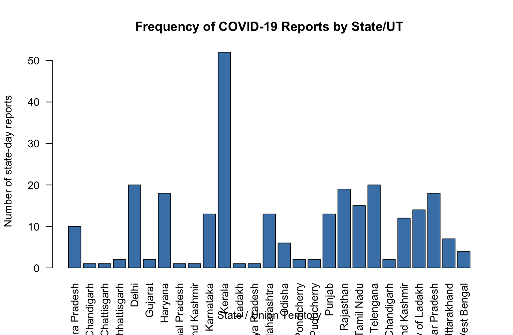
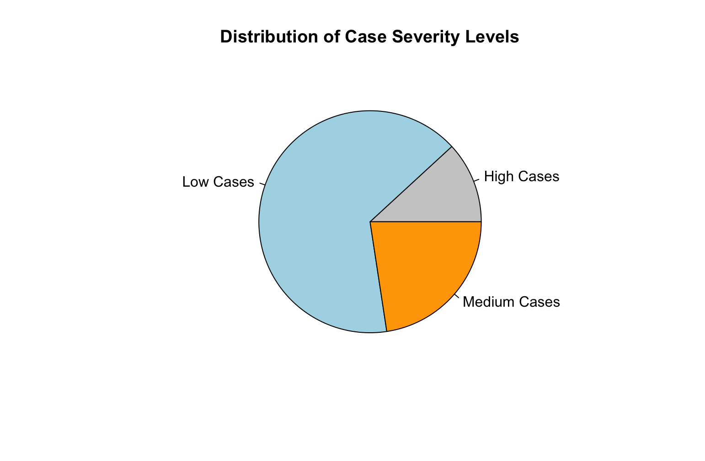
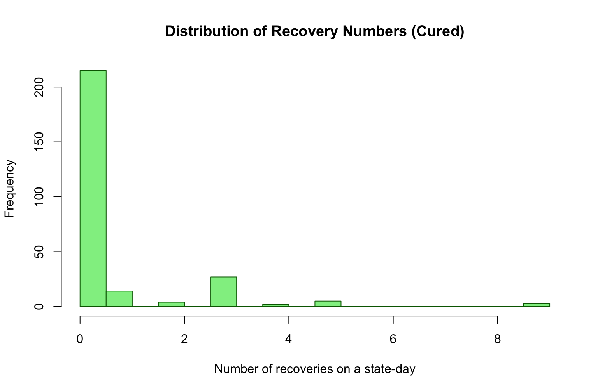
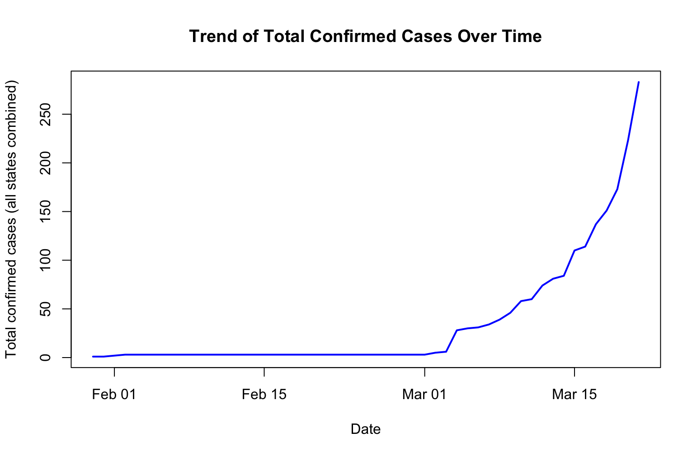

# COVID-19 India (Jan–Mar 2020) – R Exploratory Analysis

This repository contains an exploratory analysis of early COVID‑19 cases in India (January–March 2020) using a small state‑wise daily dataset. The focus is on **descriptive statistics**, **date handling**, **frequency analysis of recoveries, deaths, and case severity levels**, and **basic visualisation** using base R and the readr/dplyr packages.

## Dataset

- Source: Kaggle – "COVID-19 India Dataset (January 2020 - March 2020)" (small subset of early reports).
- Structure: 270 rows × 7 columns (state–date level reports):
  - `Sno`: serial number (numeric)
  - `Date`: report date (character converted to Date)
  - `State/UnionTerritory`: Indian state / union territory name (character)
  - `ConfirmedIndianNational`: confirmed cases among Indian nationals (numeric)
  - `ConfirmedForeignNational`: confirmed cases among foreign nationals (numeric)
  - `Cured`: recovered cases (numeric)
  - `Deaths`: deaths (numeric)

The raw CSV is **not** included in this repo; you can download it from Kaggle and place it locally if you want to reproduce the analysis.

## Analysis steps

All analysis is demonstrated in **R 4.6.0**. The core script is `scripts/01_covid_india_exploration.R`.

### 1. Load and inspect the data

Key commands used:

```r
library(readr)
Covid <- read_csv("Covid19 India (Jan 20 - Mar 20).csv")

str(Covid)
head(Covid)
summary(Covid)

nrow(Covid)     # number of rows
ncol(Covid)     # number of columns
dim(Covid)      # rows × columns
colnames(Covid) # variable names

sum(sapply(Covid, is.numeric))   # count numeric variables
sum(sapply(Covid, is.character)) # count character variables
```

**Findings:**

- 270 observations, 7 variables.
- 5 numeric variables and 2 character variables.
- `Date` initially imported as character.

### 2. Convert Date to proper Date type

The `Date` column is stored as strings like `"30-01-2020"` (day–month–year). This is converted to a proper Date class using `as.Date()` with an explicit format string:

```r
Covid$Date <- as.Date(Covid$Date, format = "%d-%m-%Y")
str(Covid$Date)
```

After conversion, `Date` is a `Date` vector, enabling date‑based summaries.

**Date range:**

```r
min(Covid$Date)
max(Covid$Date)
```

- Earliest report: 2020‑01‑30
- Latest report: 2020‑03‑21

### 3. Basic descriptive statistics and structure

Unique states and their counts:

```r
unique_states <- unique(Covid$`State/UnionTerritory`)
length(unique_states)              # number of unique states/UTs
state_freq <- table(Covid$`State/UnionTerritory`)

most_frequent_state <- names(which.max(state_freq))
```

**Findings:**

- 27 distinct states / union territories in this subset.
- Kerala appears most frequently in the dataset (most state–day records), reflecting its early importance in the Indian outbreak.

### 4. Frequency analysis of recoveries

Goal: understand how often state–day reports included **any recoveries**.

#### 4.1 Create a binary `has_recovery` variable

```r
Covid$has_recovery <- ifelse(Covid$Cured > 0, 1, 0)

head(Covid[, c("Date", "State/UnionTerritory", "Cured", "has_recovery")])
```

- `has_recovery = 1` if there was at least one recovery (`Cured > 0`) on that date in that state.
- `has_recovery = 0` otherwise.

#### 4.2 Frequency table and proportions

```r
recovery_freq <- table(Covid$has_recovery)
recovery_freq

recovery_prop <- prop.table(recovery_freq)
recovery_percent <- round(recovery_prop * 100, 1)
recovery_percent
```

**Results:**

- Counts:
  - `has_recovery = 0`: 215 state–day reports
  - `has_recovery = 1`: 55 state–day reports
- Percentages:
  - No recoveries: ~79.6% of reports
  - At least one recovery: ~20.4% of reports

Interpretation:

> In this early Jan–Mar 2020 window, only about one in five state‑level daily reports in India included recovery cases, while roughly four out of five reported zero recoveries.

### 5. Frequency analysis of deaths

Goal: mirror the recovery analysis for death reporting.

#### 5.1 Binary and factor variables for deaths

```r
# Binary indicator: any deaths on a state–day
Covid$has_deaths <- ifelse(Covid$Deaths > 0, 1, 0)

death_freq <- table(Covid$has_deaths)
death_freq

# Labeled factor version for readability
Covid$has_deaths_factor <- factor(
  Covid$has_deaths,
  levels = c(0, 1),
  labels = c("No Deaths", "Deaths Reported")
)

table(Covid$has_deaths_factor)
```

**Results:**

- Counts:
  - `No Deaths`: 245 state–day reports
  - `Deaths Reported`: 25 state–day reports

Interpretation:

> Deaths were even less frequently reported than recoveries in this early period; only about 25 out of 270 state–day reports contained at least one death.

### 6. Case severity categories (`case_level`)

Goal: classify each state–day into four levels based on total confirmed cases (Indian + foreign nationals):

- No Cases = 0 cases
- Low Cases = 1–5 cases
- Medium Cases = 6–15 cases
- High Cases = 16+ cases

#### 6.1 Total confirmed cases per row

```r
Covid$total_confirmed <- Covid$ConfirmedIndianNational + Covid$ConfirmedForeignNational
```

This is a **row‑wise** calculation: for each state–day, `total_confirmed` is the sum of Indian and foreign confirmed cases on that date in that state.

#### 6.2 Create `case_level` using dplyr + case_when

```r
library(dplyr)

Covid <- Covid |>
  mutate(
    case_level = case_when(
      total_confirmed == 0                          ~ "No Cases",
      total_confirmed >= 1 & total_confirmed <= 5   ~ "Low Cases",
      total_confirmed >= 6 & total_confirmed <= 15  ~ "Medium Cases",
      total_confirmed > 15                          ~ "High Cases"
    )
  )

table(Covid$case_level)
head(Covid[, c("Date", "State/UnionTerritory", "total_confirmed", "case_level")])
```

**Results:**

From `table(Covid$case_level)`:

- `Low Cases`: 177 state–day reports
- `Medium Cases`: 61 state–day reports
- `High Cases`: 32 state–day reports
- `No Cases`: 0 state–day reports

This corresponds to approximately:

- Low Cases: ~65.6%
- Medium Cases: ~22.6%
- High Cases: ~11.9%

Interpretation:

> Using a row‑wise total of confirmed cases, about two‑thirds of state‑day reports fall into the “Low Cases” category (1–5 cases), roughly one‑fifth into “Medium Cases” (6–15), and a smaller share into “High Cases” (16+), with no records classified as “No Cases” in this early dataset. This reflects that most states had relatively low case counts per day in the initial phase of the outbreak, with fewer days reaching higher loads.

### 7. State reporting frequency and top 10 states

Using the state/UT field:

```r
state_freq <- table(Covid$`State/UnionTerritory`)
state_freq

state_freq_sorted <- sort(state_freq, decreasing = TRUE)
top10_states <- head(state_freq_sorted, 10)

state_freq_sorted
top10_states
```

**Results:**

The sorted frequency table shows that:

- Kerala has 52 state–day reports.
- Delhi and Telengana have 20 reports each.
- Rajasthan has 19.
- Haryana and Uttar Pradesh have 18 each.
- Tamil Nadu has 15.
- Union Territory of Ladakh has 14.
- Karnataka and Maharashtra have 13 each.

**Top 10 most frequently reported states/UTs:**

- Kerala
- Delhi
- Telengana
- Rajasthan
- Haryana
- Uttar Pradesh
- Tamil Nadu
- Union Territory of Ladakh
- Karnataka
- Maharashtra

Interpretation:

> Kerala appears most frequently in this early dataset, followed by a cluster of other states and union territories with high reporting counts. This pattern highlights where early surveillance and reporting activity was most dense between late January and late March 2020.

### 8. Visualisations (Data Activity 4)

#### 8.1 State reporting frequency bar chart

```r
state_freq <- table(Covid$`State/UnionTerritory`)

barplot(state_freq,
        las = 2,
        col = "steelblue",
        main = "Frequency of COVID-19 Reports by State/UT",
        xlab = "State / Union Territory",
        ylab = "Number of state-day reports")
```



#### 8.2 Case severity pie chart

```r
case_freq <- table(Covid$case_level)

pie(case_freq,
    main = "Distribution of Case Severity Levels",
    col = c("gray80", "lightblue", "orange", "red"))
```



#### 8.3 Histogram of recovery numbers

```r
hist(Covid$Cured,
     main = "Distribution of Recovery Numbers (Cured)",
     xlab = "Number of recoveries on a state-day",
     ylab = "Frequency",
     col = "lightgreen",
     border = "darkgreen")
```



#### 8.4 Line chart of total confirmed cases over time

```r
Covid$total_confirmed <- Covid$ConfirmedIndianNational + Covid$ConfirmedForeignNational

total_by_date <- aggregate(total_confirmed ~ Date, data = Covid, sum)

plot(total_by_date$Date, total_by_date$total_confirmed,
     type = "l",
     col = "blue",
     lwd = 2,
     main = "Trend of Total Confirmed Cases Over Time",
     xlab = "Date",
     ylab = "Total confirmed cases (all states combined)")
```



## Additional R practice (Week 2 context)

In the same session, some core R concepts were practiced on small toy examples:

- **Vectors and operations**: creating numeric vectors, checking type (`is.vector`, `class`, `str`, `length`), and performing arithmetic.
- **Matrices**: building a matrix with `seq()` and `matrix()`, indexing elements, and using `which(..., arr.ind = TRUE)` to find positions.
- **Random sampling**: using `sample()` to generate random integers and `runif()` + `floor()` for uniform random numbers.
- **Apply family**:
  - `apply(students[, c("english", "math")], 1, sum)` for row‑wise totals.
  - `lapply(students, sum)` and `sapply(students, sum)` for column‑wise summaries.
- **Factors**: creating labeled categorical variables with `factor()`:

  ```r
  gender <- c(1, 2, 1, 2, 2, 2, 1, 2)
  fac_gender <- factor(gender,
                       levels = c(1, 2),
                       labels = c("Male", "Female"))
  ```

These exercises support the main COVID analysis by reinforcing data structures, indexing, and summarisation skills.

## Reproducibility notes

To rerun the analysis:

1. Install R (4.6.0 or later) and RStudio.
2. Install required packages:

   ```r
   install.packages("readr")
   install.packages("dplyr")
   ```

3. Download the CSV from Kaggle (Jan–Mar 2020 India COVID dataset) and update the file path in `scripts/01_covid_india_exploration.R`.
4. Run the commands in `scripts/01_covid_india_exploration.R` or copy-paste from the README into your R session.

## Next steps / possible extensions

In future iterations of this project, I plan to:

- Aggregate cases per state and compute total confirmed, recovered, and deaths over the period.
- Plot an early epidemic curve by date using base R or ggplot2.
- Compare recovery and death frequencies by state (e.g. proportion of state–day reports with at least one recovery or death).
- Extend the dataset beyond March 2020 for longer-term trend analysis.
